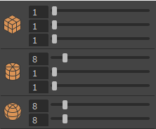
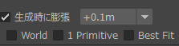
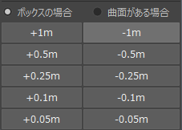

# 機能・使い方

## 基本的な使い方

1. **オブジェクト選択**: コライダーを作成したいオブジェクト（またはフェース・頂点）を選択します。
2. **形状選択**: ツール上部のアイコンから、作成したい形状（Cube, Cylinder, Sphere）をクリックします。
3. **作成**: 選択したオブジェクトのバウンディングボックスに合わせて、コライダー用オブジェクトが生成されます。
   - 生成されたオブジェクトには、自動的に`Colliders_mt`（緑色の半透明マテリアル）が割り当てられます。
4. **調整**: 作成したコライダーのフェースを選択して「+1m」等のボタンを押して調整します。

## UI項目の説明

### 形状と分割数
各形状のアイコンの横にあるスライダーで、生成時の分割数を調整できます。

- **Cube**: 幅、高さ、奥行きの分割数
- **Cylinder**: 軸の分割数、高さ、キャップ
- **Sphere**: 軸の分割数、高さ

### オプション設定

- **Generate On-Demand Expansion (生成時に膨張)**
  - チェックを入れると、コライダー生成時に指定したサイズ分だけ大きく作成します。
  - ドロップダウンメニューから拡張サイズ（+1m, +0.5m, +0.25m, +0.1m, +0.05m）を選択できます。

- **World**
  - チェックを入れると、ワールド座標軸に沿ったバウンディングボックスを作成します。
  - チェックを外すと、オブジェクトのローカル軸（またはBest Fit）に合わせます。

- **1 Primitive**
  - 複数のオブジェクトを選択している場合に、それらをまとめて1つのコライダーで囲みます。
  - チェックを外すと、選択したオブジェクトごとに個別のコライダーが作成されます。

- **Best Fit**
  - オブジェクトの形状を解析し、最小体積となる最適な向き（OBB）でコライダーを作成します。
  - 斜めに配置されたオブジェクトなどに正確にフィットさせたい場合に有効です。
  - ※ `World` オフ時、または `1 Primitive` オン時に利用可能です。

### 拡張機能 (Expand/Shrink)

作成済みのコライダーのサイズを後から調整できます。

1. **モード選択**:
   - **ボックスの場合**: 単純に各面を法線方向に移動します。
   - **曲面がある場合**: スムーズに法線方向に拡張します（CylinderやSphere向け）。

2. **サイズ変更ボタン**:
   - `+1m` / `-1m`
   - `+0.5m` / `-0.5m`
   - `+0.25m` / `-0.25m`
   - `+0.1m` / `-0.1m`
   - `+0.05m` / `-0.05m`

ボタンを押すと、選択中のオブジェクト（または選択コンポーネント）に対して、指定した距離だけ拡張・縮小を行います。

## その他

- **単位について**: 本ツールはメートル(m)単位での運用を強制します。Mayaの設定に関わらず、数値はメートルとして扱われます。
